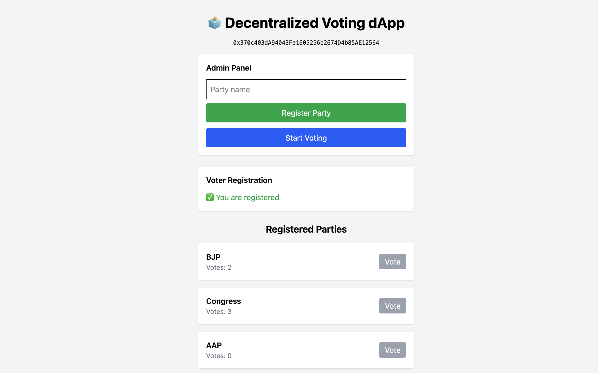
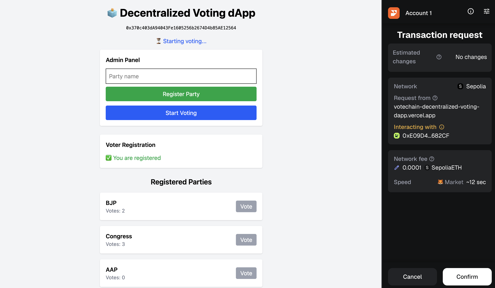
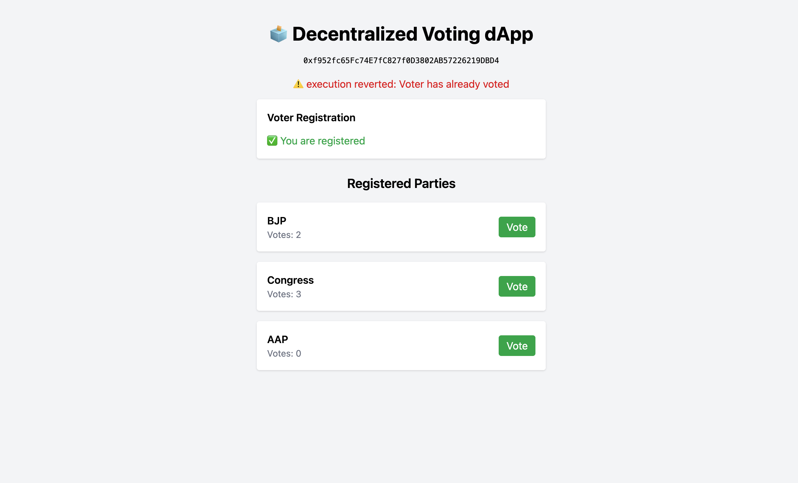
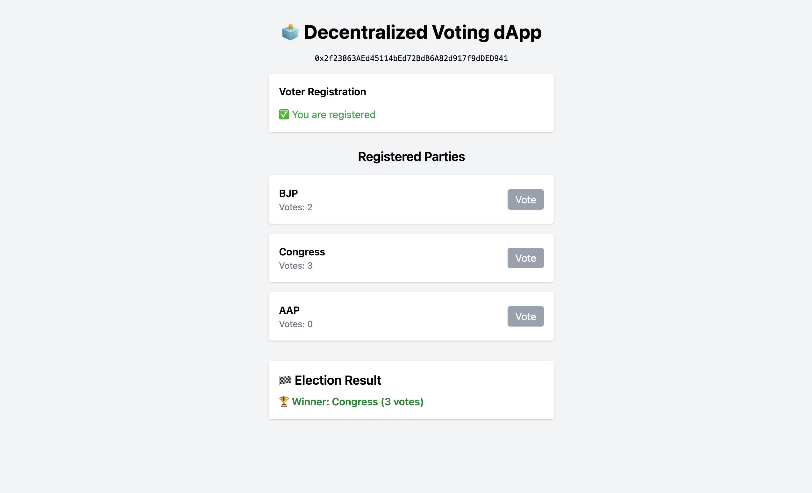
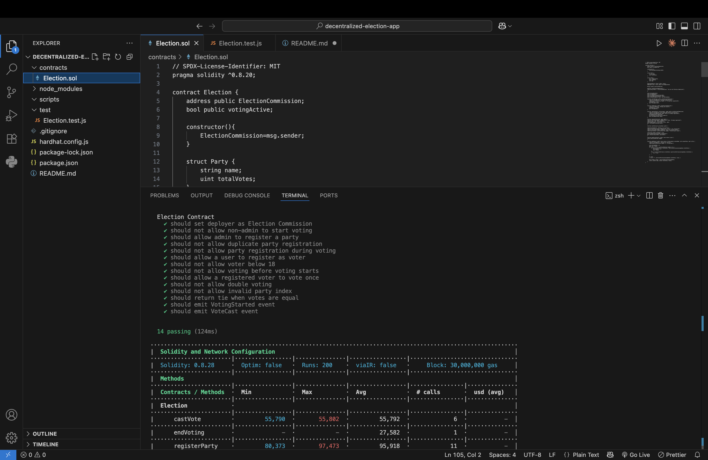
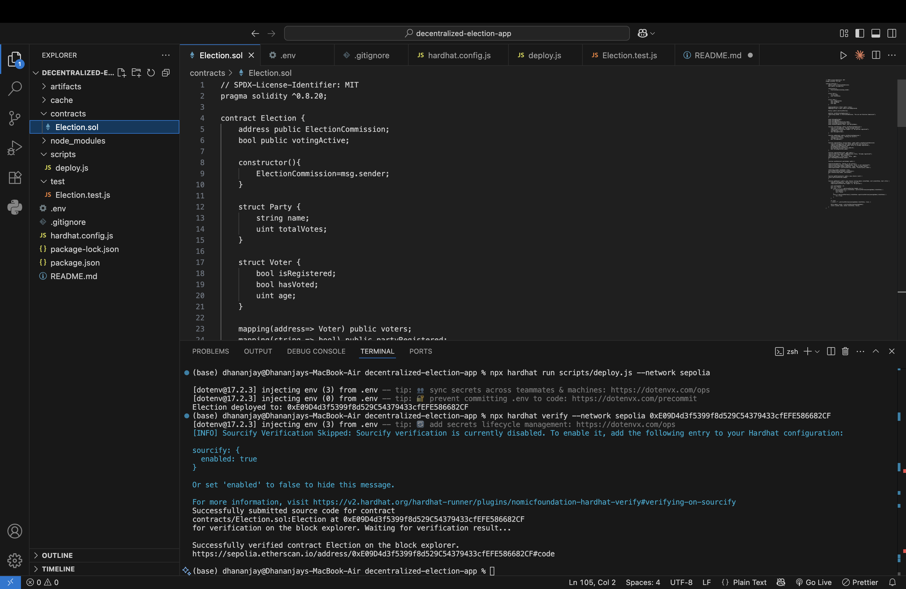

# Votechain- Decentralized Voting dApp (Ethereum)

A production-grade decentralized voting application built on Ethereum that enables transparent, tamper-proof elections with strict on-chain enforcement of voting rules and a modern React-based frontend.

This project demonstrates real-world Web3 engineering, including smart contract lifecycle management, revert-safe UI design, event-based auditability, and full CI/CD deployment.

## Live Demo

Frontend (Vercel):
https://votechain-decentralized-voting-dapp.vercel.app/

Smart Contract (Sepolia Etherscan):
https://sepolia.etherscan.io/address/0xE09D4d3f5399f8d529C54379433cfEFE586682CF

## Features

Smart Contract (Solidity)
- Admin-controlled election lifecycle (start and end voting)
- Secure party registration blocked during active elections
- Voter registration with age eligibility (18+)
- One-vote-per-wallet enforcement
- Tie detection and zero-vote election handling
- On-chain transparency using emitted events
- Fully verified contract on Etherscan

Frontend (React + Ethers.js)
- MetaMask wallet integration
- Role-based UI for Admin and Voters
- UI-level validation to prevent gas-wasting transactions
- Real-time election status and vote counts
- Loaders during blockchain transaction confirmations
- Solidity revert messages surfaced directly in the UI

## Architecture Overview

contracts/
  Election.sol

scripts/
  deploy.js

test/
  Election.test.js

frontend/
  src/
    abi/
    App.jsx
    config.js
  dist/

hardhat.config.js

## Smart Contract Design

Election Lifecycle
1. Admin registers political parties
2. Admin starts voting
3. Users register as voters
4. Each voter casts exactly one vote
5. Admin ends voting
6. Results are computed automatically on-chain

Transparency vs Privacy
- Votes are not stored per voter address
- Each vote emits a VoteCast event
- Full auditability via Etherscan logs
- Prevents simple address-to-vote lookups

## Core Solidity Functions

- registerParty(string name)
- registerVoter(uint age)
- castVote(uint partyIndex)
- startVoting()
- endVoting()
- getWinner()

## Testing

- Written using Hardhat
- Covers access control, revert conditions, voting lifecycle, one-vote-per-wallet logic, and tie scenarios

Run tests locally:
npx hardhat test

## Tech Stack

- Blockchain: Ethereum (Sepolia)
- Smart Contracts: Solidity
- Framework: Hardhat
- Frontend: React + Vite
- Styling: Tailwind CSS
- Web3 Library: Ethers.js v6
- Wallet: MetaMask
- Deployment: Vercel
- Verification: Etherscan

## Screenshots

### Admin Panel (Party Registration & Election Control)

### Voting Started (Active Election State)

### Party Registration Revert During Election

### Election Result (Winner / Tie Handling)

### Tie Scenario Result

### Smart Contract Tests (Hardhat)

### Deployment & Contract Verification

## Key Engineering Decisions

- Results exposed via view functions instead of transactions
- UI prevents invalid actions before hitting contract reverts
- Events used for auditability instead of extra storage
- Frontend and blockchain dependencies isolated for CI safety
- Explicit revert reasons mapped directly to user-facing errors

## Future Enhancements

- Zero-knowledge voting
- Commit-reveal voting scheme
- Multi-election support
- DAO-style governance extensions
- Off-chain indexing using The Graph

## Author

Dhananjay Badoni  
GitHub: https://github.com/Dhananjay0719  

## License

MIT License

Project Status: Completed, Deployed, Production-ready
